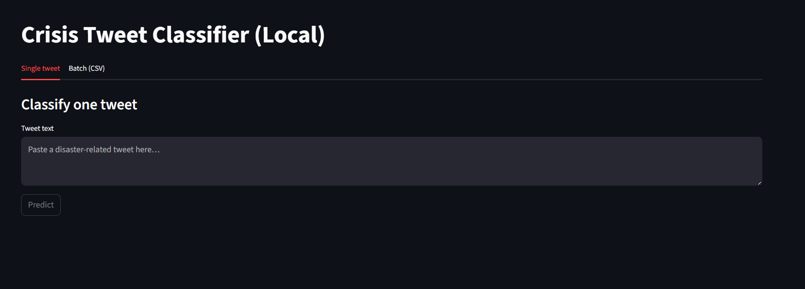
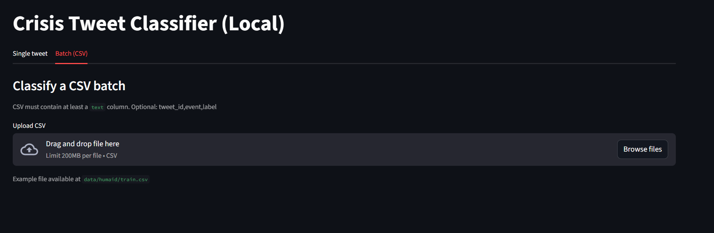
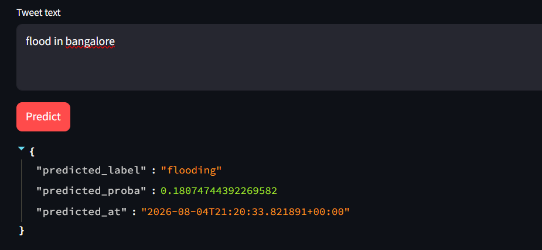
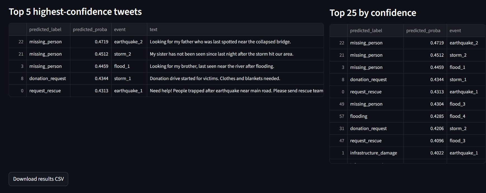
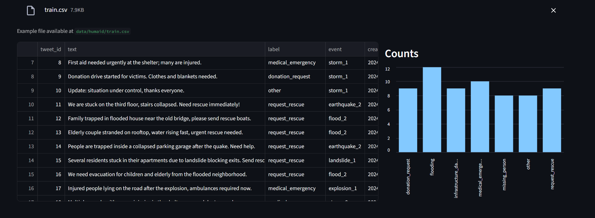

<div align="center">

# 🌍 AAPDA – Disaster Information Extractor from Tweets

### Cloud-Based Disaster Information Extraction & Classification System using NLP, Machine Learning and Google Cloud Platform


A cloud-based disaster tweet classification system that uses **Natural Language Processing (NLP)** and **Machine Learning** to automatically classify crisis-related tweets into actionable emergency categories while leveraging **Google Cloud Platform** for storage, automation, and analytics.

</div>

---

# 📖 Overview

During natural disasters, thousands of tweets are posted every minute containing valuable information about affected areas, rescue requests, damaged infrastructure, and medical emergencies. Manually processing such large volumes of information is difficult and time-consuming.

**AAPDA** is a cloud-based disaster information extraction system that automatically classifies disaster-related tweets into predefined emergency categories using **TF-IDF Vectorization** and **Logistic Regression**. The project integrates multiple Google Cloud services to automate data processing, prediction, storage, scheduling, and visualization.

The system demonstrates a complete machine learning workflow from data preprocessing and model training to cloud deployment and dashboard-based monitoring.

---

# 🎯 Objectives

- Classify disaster-related tweets into emergency categories.
- Build an end-to-end NLP and machine learning pipeline.
- Automate prediction and cloud-based data processing.
- Store and visualize prediction results using Google Cloud services.

---

# ✨ Features

- 🌍 Disaster Tweet Classification
- 📝 TF-IDF + Logistic Regression Model
- ☁ Google Cloud Platform Integration
- 🗄 BigQuery Data Storage
- ⚡ Cloud Functions & Cloud Scheduler Automation
- 📈 Streamlit & Looker Studio Dashboards
- 📊 Model Evaluation & Performance Reports

---

# 🏗 System Architecture

```text
                  Disaster Tweets
                         │
                         ▼
                Data Preprocessing
                         │
                         ▼
              TF-IDF Feature Extraction
                         │
                         ▼
            Logistic Regression Model
                         │
          ┌──────────────┴──────────────┐
          ▼                             ▼
 Google Cloud Storage            BigQuery Database
(Model Artifacts)       (Predictions • Alerts • Logs)
          │                             │
          └──────────────┬──────────────┘
                         ▼
            Cloud Function (BatchPredict)
                         │
                         ▼
               Cloud Scheduler Trigger
                         │
                         ▼
      Streamlit Dashboard & Looker Studio
```

---

# 🛠 Tech Stack

| Category | Technologies |
|-----------|--------------|
| Programming Language | Python |
| Machine Learning | Scikit-Learn |
| NLP | TF-IDF Vectorization |
| Classification | Logistic Regression |
| Cloud Platform | Google Cloud Platform |
| Data Warehouse | BigQuery |
| Storage | Google Cloud Storage |
| Automation | Cloud Functions, Cloud Scheduler |
| Dashboard | Streamlit, Looker Studio |
| Deployment | Docker |

---

# 📂 Dataset

Supported datasets:

- HumAID Dataset
- CrisisNLP Dataset (Optional Tweet Rehydration)

Dataset fields:

- tweet_id
- text
- label
- event
- created_at

Classification Categories:

- Infrastructure Damage
- Medical Emergency
- Missing Person
- Donation Request
- Request Rescue
- Flooding
- Other

---

# 📊 Model Evaluation

The trained model is evaluated using:

- Accuracy
- Precision
- Recall
- F1-Score
- Confusion Matrix

Example Evaluation:

| Metric | Value |
|---------|------:|
| Accuracy | 98.5% |
| Weighted F1 Score | 98.5% |

---

# 📁 Project Structure

```text
AAPDA/
│
├── cloud_function/
├── crisis_nlp/
├── scripts/
├── infra/
├── data/
├── artifacts/
│
├── bootstrap_local.ps1
├── deploy_gcp.ps1
├── local_dashboard.py
├── Dockerfile
├── requirements.txt
├── pyproject.toml
└── README.md
```

---

# 🚀 Installation

Clone the repository

```bash
git clone https://github.com/vaibhav-tiwari-7/AAPDA-Disaster-Information-Extractor-from-Tweets.git
```

Navigate into the project

```bash
cd AAPDA-Disaster-Information-Extractor-from-Tweets
```

Create a virtual environment

```bash
python -m venv .venv
```

Activate it

### Windows

```bash
.\.venv\Scripts\Activate.ps1
```

Install dependencies

```bash
pip install -r requirements.txt
```

---
# ⚡ Quick Start (Windows)

For Windows users, the easiest way to launch the project is by running the provided launcher.

Simply double-click:

```text
run.bat
```

The launcher will automatically:

- ✔ Check if Python is installed
- ✔ Create a virtual environment (only on the first run)
- ✔ Install the required dependencies (if needed)
- ✔ Launch the Streamlit dashboard

Once the application starts, it will be available at:

```text
http://localhost:8501
```

> **Note:** The `run.bat` launcher is intended for **Windows** systems only. Users on Linux or macOS should follow the manual installation and execution steps described below.

---

# ▶️ Train the Model

```bash
python scripts/train_model.py --train_csv data/humaid/train.csv --out_dir artifacts
```

---

# 📈 Evaluate the Model

```bash
python scripts/evaluate_model.py --model_dir artifacts --test_csv data/humaid/train.csv
```

---

# 🌐 Run the Dashboard

```bash
streamlit run local_dashboard.py
```

Open:

```
http://localhost:8501
```

---

# ☁ Google Cloud Deployment

The project supports deployment using:

- Google Cloud Storage
- BigQuery
- Cloud Functions
- Cloud Scheduler

Deployment scripts:

```text
bootstrap_local.ps1
deploy_gcp.ps1
```

---

# 📊 Generated Outputs

The project generates:

- Trained Model Artifacts
- Prediction Reports
- Classification Results
- Evaluation Metrics
- Confusion Matrix
- BigQuery Prediction Tables
- Alert Tables
- Audit Logs
- Dashboard Visualizations

---

# 🔑 Environment Variables

```env
PROJECT_ID=YOUR_PROJECT_ID
REGION=us-central1
BUCKET=YOUR_BUCKET_NAME
BQ_DATASET=crisis_nlp
```

Optional:

```env
X_BEARER_TOKEN=YOUR_TWITTER_API_TOKEN
```

---


# 📷 Dashboard

<div align="center">




<br><br>





</div>

The screenshots above demonstrate the Streamlit dashboard, prediction workflow, classification results, and performance analytics generated by the system.

---

# 👨‍💻 Author

**Vaibhav Tiwari**

Computer Science & Engineering

Siddaganga Institute of Technology

---

# 📌 Project Status

Academic cloud computing project demonstrating an end-to-end disaster information extraction pipeline using NLP, Machine Learning, and Google Cloud Platform.

---

# 📄 License

This project is intended for academic and educational purposes.